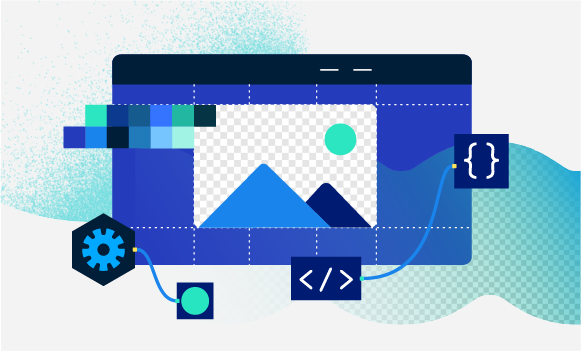

---
keywords:
  - Photo editor API
  - Photoshop workflow automation
  - Image editor API
  - Photoshop API
  - Image editing API for developers
  - Photoshop in the Cloud
  - Remove background API
  - API Documentation
  - UXP
  - Plugins
  - JavaScript
  - ExtendScript
  - SDK
  - C++
  - Scripting
title: Photoshop API
---
[//]: # (-----------------------------------Hero Section--------------------------------------------------------)
<Hero slots="image, heading, text, buttons" variant="fullwidth" background="rgb(12, 50, 63)" className="remove-background-hero" />


# Remove background API

Remove background and create object masks with ease.

* [Start free trial](signup.md?ref=signup)
* [Try demo](demo.md)


<TextBlock slots="heading, text1, buttons" theme="light" isCentered
className="remove-background-sdk-sign-up"/>

### Sign up for early access to our Remove Background web SDK.

Be the first to try our web SDK to help accelerate time to market.

* [Sign up](https://calendly.com/brianbabbitt/30min)


[//]: # (-----------------------------------River Flow Section --------------------------------------------------------)
<TextBlock slots="image, heading, text" theme="lightest" />



### Riverflow

Vivamus magna justo, lacinia eget consectetur sed, convallis at tellus. Nulla porttitor accumsan tincidunt. Quisque velit nisi, pretium ut lacinia in, elementum id enim.


<TextBlock slots="heading, text, image" theme="lightest" />

### Riverflow

Vivamus magna justo, lacinia eget consectetur sed, convallis at tellus. Nulla porttitor accumsan tincidunt. Quisque velit nisi, pretium ut lacinia in, elementum id enim.


[//]: # (-----------------------------------Three Up Section --------------------------------------------------------)
<TextBlock slots="heading, text" width="33%" theme="lightest" isCentered className="index-value-prop-a" />

### Real Estate

Use our API to leverage our models to auto enhance your images and make them stand out from the rest.  


<TextBlock slots="heading, text" width="33%" theme="lightest" isCentered className="index-value-prop-b" />

### E-commerce

Easily scale the number of product listings you have, beautify them, and easily create multiple variations.


<TextBlock slots="heading, text" width="33%" theme="lightest" isCentered className="index-value-prop-c"/>

### Marketing

Generate thousands of assets and renditions needed to get your marketing campaigns launched sooner.


<CodeBlock slots="heading, code" repeat="2" languages="JSON, CURL, JSON" />


### Request

```bash
curl -X POST 'https://image.adobe.io/sensei/mask' \
  -H "x-api-key: $apiKey" \
  -H "Content-Type: application/x-www-form-urlencoded" \
  -H "Authorization: Bearer $token" \
  -d '{
   "input":{
      "storage":"<storage>",
      "href":"<href>"
   },
   "output":{
      "storage":"<storage>",
      "href":"<href>"
      "mask":{
         "format":"<soft|binary>"
      }
   }
}'
```

### Response

```json
{"widget": {
    "debug": "on",
    "window": {
        "title": "Sample Konfabulator Widget",
        "name": "main_window",
        "width": 500,
        "height": 500
    },
    "image": {
        "src": "Images/Sun.png",
        "name": "sun1",
        "hOffset": 250,
        "vOffset": 250,
        "alignment": "center"
    },
    "text": {
        "data": "Click Here",
        "size": 36,
        "style": "bold",
        "name": "text1",
        "hOffset": 250,
        "vOffset": 100,
        "alignment": "center",
        "onMouseUp": "sun1.opacity = (sun1.opacity / 100) * 90;"
    }
}}    
```


[//]: # (-----------------------------------Summary Section --------------------------------------------------------)
<SummaryBlock slots="image, heading, text, buttons" background="rgb(12, 50, 63)" className="remove-background-summary"/>


## Unlock the power of Photoshop APIs, now in the cloud

Sign up now to get access to the world’s standard in game-changing imaging technology.

* [Start free trial](signup.md?ref=signup)
* [Try demo](demo.md)
